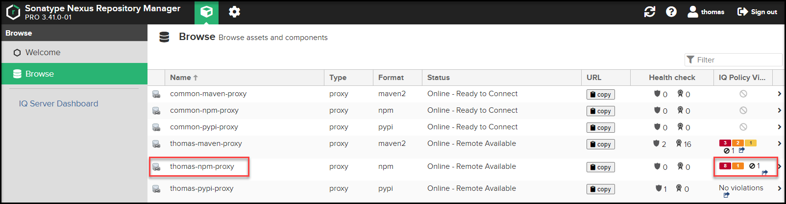
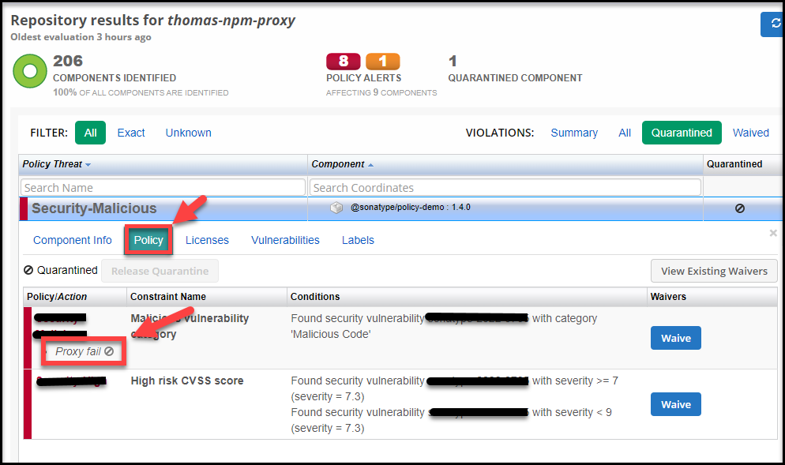

* * *

Mission2 목표!
============

*   Sonatype 에서 데모용으로 사용하는 **Policy-demo 모듈을 다운로드** 진행,
    
*   Policy-demo 모듈 **IQServer에 의해서 격리 되는지 확인**!
    
*   IQServer 접속 하여 취약성 **Report를 확인하고 미션을 확인**하자!
    

1\. Policy-Demo 패키지 설치 와 격리 확인
==============================

`@sonatype/policy-demo` 패키지 설치를 진행하고 아래와 같이  
`REQUESTED ITEM IS QUARANTINED` ERROR 메시지 확인.

```java
# npm install @sonatype/policy-demo
---
npm ERR! code E403
npm ERR! 403 403 -------------------->>> REQUESTED ITEM IS QUARANTINED -------------------->>> FOR DETAILS SEE ------>>> 
http://iq-workshop.openmsa.cloud:8070/ui/links/repositories/quarantinedComponent/YWFkYmFiMGY0NzM0NDY3YmE4YzZjZDM3MjRkYTk4M2M <<<------ - GET https://nexus-workshop.openmsa.cloud:8443/repository/thomas-npm-proxy/@sonatype/policy-demo/-/policy-demo-1.4.0.tgz
npm ERR! 403 In most cases, you or one of your dependencies are requesting
npm ERR! 403 a package version that is forbidden by your security policy, or
npm ERR! 403 on a server you do not have access to.

npm ERR! A complete log of this run can be found in:
npm ERR!     C:\Users\user\AppData\Local\npm-cache\_logs\2022-08-29T09_20_14_868Z-debug-0.log
```

2\. IQ-server 접속 및 Report 확인
============================

2-1. Report 확인 (1)
------------------

위 에러에서 발생한 `FOR DETAILS SEE ------>>>` 문구에서 제공한 Iq-server URL 확인하여 Report 확인  
Ex) `http://iq-workshop.openmsa.cloud:8070/ui/links/repositories/quarantinedComponent/YWFkYmFiMGY0NzM0NDY3YmE4YzZjZDM3MjRkYTk4M2M`

2-2. Report 확인 (2)
------------------

또는 Nexus에 접속하여 연동된 IqServer 를 직접 링크를 타고 확인

넥서스 링크를 타고 입장하면 “금지아이콘”으로 표시되어 격리가 된것을 육안으로 확인 할 수 있습니다.



2-3. 로그인
--------


3\. Report 확인 및 Mission 2 문제 확인 !
=================================

**Report를 확인하여 아래 문항에 관련한 문제를 확인하여 제출하면 성공!**  
문제의 관련한 힌트는 아래 사항의 사진에서 빨간박스 부분을 통해 확인 할 수 있습니다.
    

* * *

접속하여 `Quarantined` 을 클릭하여 격리되어있는 컴포넌트를 확인 할 수 있습니다.  
이후 해당 컴포넌트를 클릭하여 컴포넌트 와 격리정책을 살펴봅니다.


1.  아래 사항 취약점에 대한 정보를 확인하고 Info를 클릭하여 자세한 정보를 확인합니다.
    
    1.  **Threat Level**
        
    2.  **Problem Code**
        


Policy 탭으로 이동합니다.




* * *

여기까지 오시느라 수고하셨습니다!
------------------
